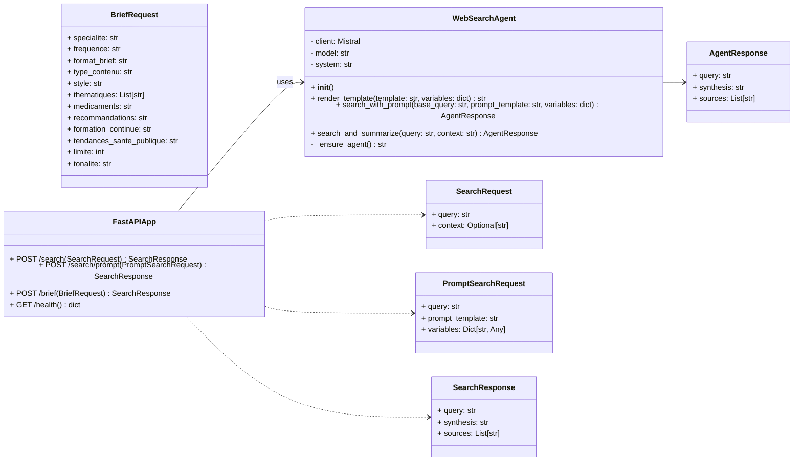
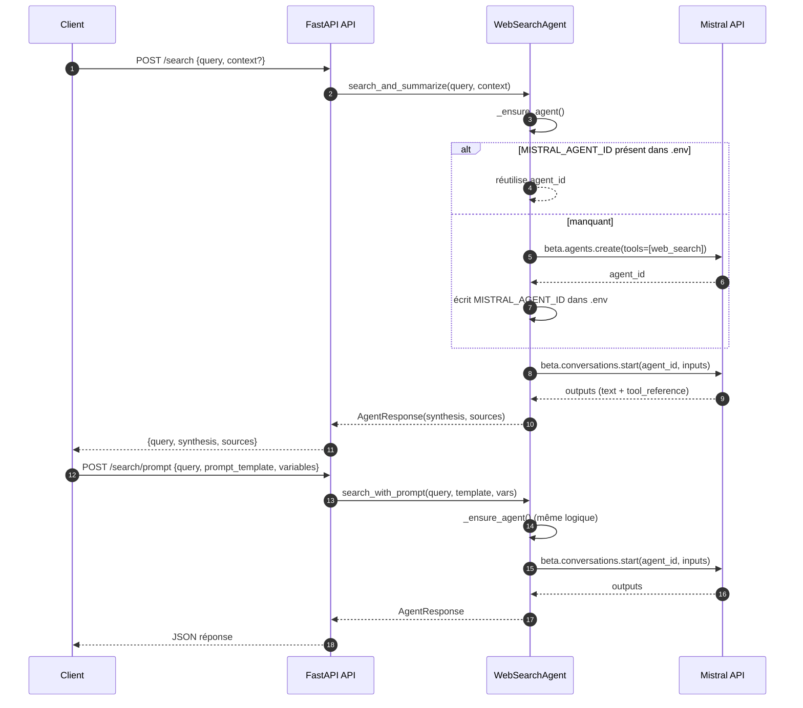
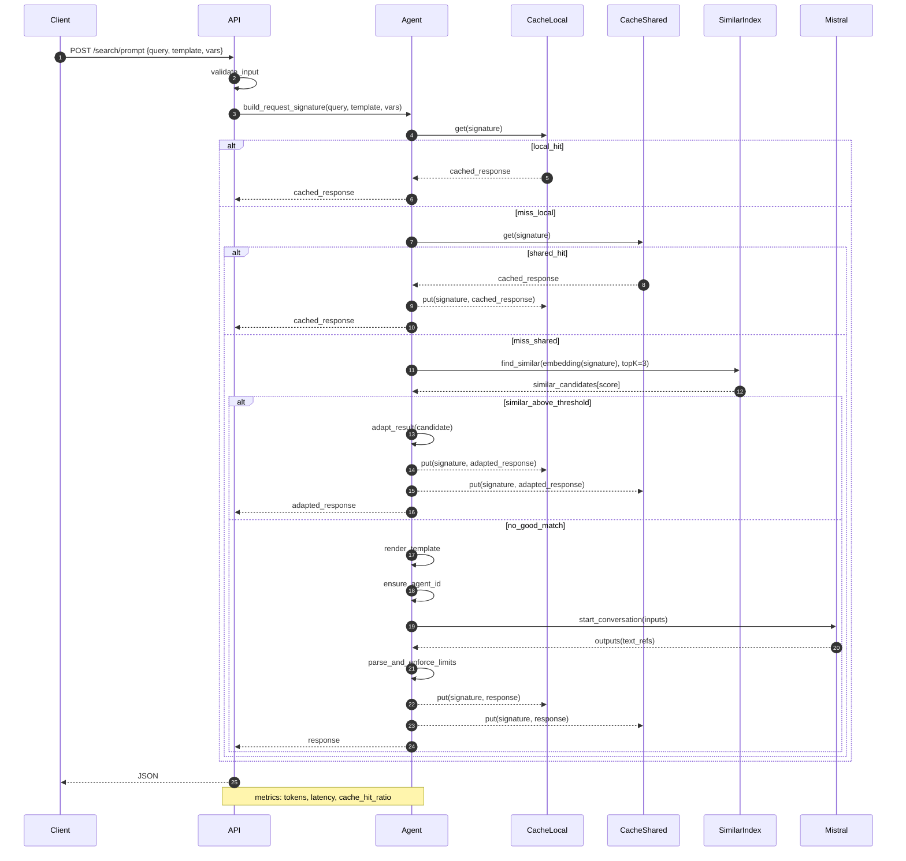

# Mistral WebSearch Agent (minimal)

Agent de recherche web basé sur l'API Mistral (connecteur `web_search`). Projet minimal: uniquement agent, API et configuration.

## 1) Prérequis
- Python 3.10+
- Clé API Mistral: https://console.mistral.ai/

## 2) Installation
```bash
pip install -r requirements.txt
```

## 3) Configuration
Créer un fichier `.env` à la racine du projet, puis ajoutez:
```
MISTRAL_API_KEY=VOTRE_CLE
MISTRAL_MODEL=mistral-large-latest
```
> À la première exécution, l'agent créera automatiquement un agent Mistral avec le connecteur web_search et enregistrera `MISTRAL_AGENT_ID` dans `.env`.

## 4) Test rapide (agent direct)
Exécuter une recherche simple sans lancer de serveur:
```bash
python -c "from agent import WebSearchAgent; a=WebSearchAgent(); r=a.search_and_summarize('intelligence artificielle médecine 2024'); print(r.synthesis[:500]); print('\nSources:', len(r.sources)); [print('-', s) for s in r.sources[:5]]"
```

## 5) API HTTP minimale
Lancer l'API FastAPI:
```bash
python api.py
```
Endpoints:
- `GET  /health` — statut de l'API
- `POST /search` — recherche standard avec `query` (et optionnel `context`)
- `POST /search/prompt` — recherche avec template de prompt personnalisé
- `POST /brief` — génération d’un "Brief Médical Flash" personnalisé pour un médecin (voir exemple plus bas)

Exemples:
```bash
# Healthcheck
curl http://localhost:8000/health

# Recherche simple
curl -X POST http://localhost:8000/search \
  -H "Content-Type: application/json" \
  -d '{"query":"intelligence artificielle médecine 2024"}'

# Recherche avec template de prompt
curl -X POST http://localhost:8000/search/prompt \
  -H "Content-Type: application/json" \
  -d '{
    "query": "intelligence artificielle médecine 2024",
    "prompt_template": "Tu es un assistant spécialisé en résumé médical... Limite: {{limite}} mots. Style: {{style}}.",
    "variables": {"limite": 180, "style": "bullet points", "specialite": "Médecine générale", "tonalite": "professionnelle", "medicaments": "anticoagulants", "recommandations": "HAS, ESC"}
  }'

# Brief Médical Flash
curl -X POST http://localhost:8000/brief \
  -H "Content-Type: application/json" \
  -d '{
    "specialite": "Médecine générale",
    "frequence": "quotidienne",
    "format_brief": "résumé structuré",
    "type_contenu": "guidelines + actualités",
    "style": "bullet points",
    "thematiques": ["cardiologie", "diabète", "vaccination"],
    "medicaments": "HAS, ANSM",
    "recommandations": "HAS, ESC",
    "formation_continue": "MOOCs, conférences",
    "tendances_sante_publique": "ECDC, WHO",
    "limite": 180,
    "tonalite": "professionnelle"
  }'

```

## 6) Paramètres supportés
- `.env`
  - `MISTRAL_API_KEY` (obligatoire)
  - `MISTRAL_MODEL` (optionnel, défaut: `mistral-large-latest`)
  - `MISTRAL_AGENT_ID` (optionnel, auto-ajouté après création du premier agent)

## 7) Notes
- Le connecteur `web_search` est utilisé par défaut; le modèle cite des sources (URLs) dans la réponse.
- Le champ `prompt_template` accepte des variables au format `{{nom}}` (remplacement direct côté agent).
- Pour stopper l’API, interrompre le processus (Ctrl+C).


## 8) Diagrammes UML

### 8.1 Diagramme de classes (UML)


**Résumé en mots simples**
- L’assistant de recherche reçoit votre question, lance la recherche et fabrique un résumé avec des liens.
- L’application web expose 3 routes: contrôle de santé, recherche classique, recherche guidée par un texte.
- Les échanges: question (+ contexte éventuel) à l’aller; au retour: résumé clair et liste des sources.
- Détail interne: au premier démarrage, l’assistant crée/configure son profil côté service d’IA si nécessaire.


### 8.2 Diagramme de séquence (UML)


**Résumé en mots simples**
- Vous envoyez une question à l’application.
- L’application la donne à l’assistant qui vérifie qu’il est prêt côté service d’IA.
- L’assistant interroge le service d’IA qui fait la recherche web et renvoie texte + références.
- L’assistant renvoie à l’application un résumé propre avec les sources.
- Variante “avec texte-guide”: même parcours, mais vous fournissez un canevas pour orienter le style du résumé.


## 9) Diagramme de séquence optimisé (/search/prompt)


> Note: Le diagramme de séquence optimisé ci-dessus est conceptuel et non implémenté dans ce dépôt minimal.


**Résumé en mots simples**
- Avant de relancer une vraie recherche, l’assistant regarde d’abord dans sa mémoire locale, puis partagée.
- S’il trouve une réponse identique ou très proche, il la renvoie aussitôt (économie de temps et de coût).
- Sinon, il effectue la recherche via le service d’IA, prépare le résumé et met en cache la réponse pour la prochaine fois.
- Le système suit aussi quelques indicateurs simples: rapidité, consommation et taux de réutilisation du cache.


### Pistes d’optimisation complémentaires
- Budgetisation/cutoff: ne pas lancer LLM si coût estimé > budget (p.ex. tokens restants/jour)
- Batching: regrouper des requêtes proches en une seule conversation (mode “digest”)
- Paramètres dynamiques: ajuster temperature/top_p selon criticité clinique
- Filtrage de sources: privilégier HAS, ANSM, PubMed, ESC, ECDC, WHO
- TTL différenciés: augmenter TTL pour requêtes stables (guidelines), réduire pour actualités
- Observabilité: suivre tokens prompts/completions/connectors et p95/p99 latence

