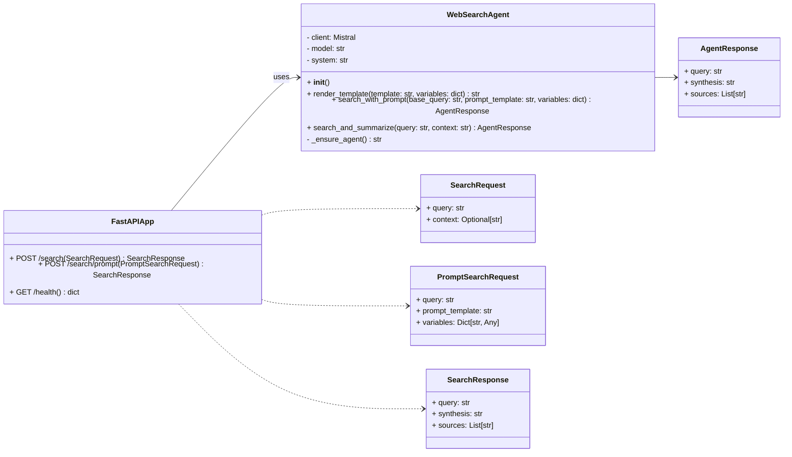
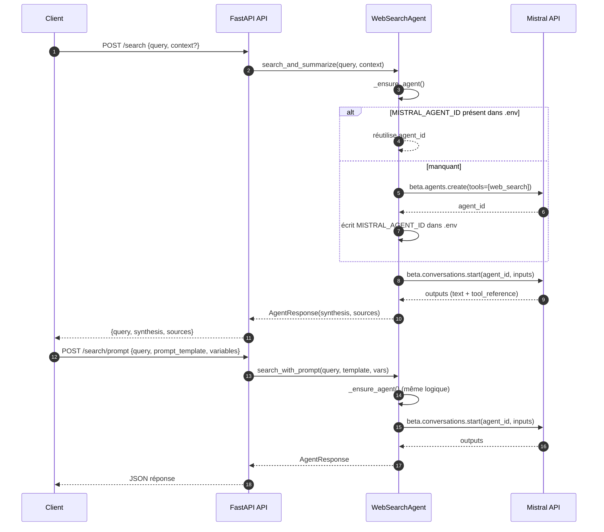

# Mistral WebSearch Agent (minimal)

Agent de recherche web basé sur l'API Mistral (connecteur `web_search`). Projet minimal: uniquement agent, API et configuration.

## 1) Prérequis
- Python 3.10+
- Clé API Mistral: https://console.mistral.ai/

## 2) Installation
```bash
pip install -r requirements.txt
```

## 3) Configuration
1. Copier le fichier d'exemple puis éditer:
```bash
cp .env.example .env
```
2. Mettre votre clé dans `.env`:
```
MISTRAL_API_KEY=VOTRE_CLE
MISTRAL_MODEL=mistral-large-latest
```
> À la première exécution, l'agent créera automatiquement un agent Mistral avec le connecteur web_search et enregistrera `MISTRAL_AGENT_ID` dans `.env`.

## 4) Test rapide (agent direct)
Exécuter une recherche simple sans lancer de serveur:
```bash
python -c "from agent import WebSearchAgent; a=WebSearchAgent(); r=a.search_and_summarize('intelligence artificielle médecine 2024'); print(r.synthesis[:500]); print('\nSources:', len(r.sources)); [print('-', s) for s in r.sources[:5]]"
```

## 5) API HTTP minimale
Lancer l'API FastAPI:
```bash
python api.py
```
Endpoints:
- `GET  /health` — statut de l'API
- `POST /search` — recherche standard avec `query` (et optionnel `context`)
- `POST /search/prompt` — recherche avec template de prompt personnalisé

Exemples:
```bash
# Healthcheck
curl http://localhost:8000/health

# Recherche simple
curl -X POST http://localhost:8000/search \
  -H "Content-Type: application/json" \
  -d '{"query":"intelligence artificielle médecine 2024"}'

# Recherche avec template de prompt
curl -X POST http://localhost:8000/search/prompt \
  -H "Content-Type: application/json" \
  -d '{
    "query": "intelligence artificielle médecine 2024",
    "prompt_template": "Tu es un assistant spécialisé en résumé médical... Limite: {{limite}} mots. Style: {{style}}.",
    "variables": {"limite": 180, "style": "bullet points", "specialite": "Médecine générale", "tonalite": "professionnelle", "medicaments": "anticoagulants", "recommandations": "HAS, ESC"}
  }'
```

## 6) Paramètres supportés
- `.env`
  - `MISTRAL_API_KEY` (obligatoire)
  - `MISTRAL_MODEL` (optionnel, défaut: `mistral-large-latest`)
  - `MISTRAL_AGENT_ID` (optionnel, auto-ajouté après création du premier agent)

## 7) Notes
- Le connecteur `web_search` est utilisé par défaut; le modèle cite des sources (URLs) dans la réponse.
- Le champ `prompt_template` accepte des variables au format `{{nom}}` (remplacement direct côté agent).
- Pour stopper l’API, interrompre le processus (Ctrl+C).


## 8) Diagrammes UML

### 8.1 Diagramme de classes (UML)


### 8.2 Diagramme de séquence (UML)



## 9) Diagramme de l’optimisation énergétique (exemple générique)
```mermaid
flowchart LR
  subgraph Sources[Acquisition & Données]
    Meters[Capteurs / Compteurs (élec, gaz, T°, CO₂)] --> Ingest[Ingestion temps réel]
    Ingest --> TSDB[(Time‑Series DB)]
    Ext[Tarifs / Météo / Calendrier / Production PV] --> Ingest
  end

  subgraph IA[Prédiction]
    TSDB --> Forecast[Prévisions (charge, PV, prix)]
  end

  subgraph Opti[Moteur d'optimisation]
    Forecast --> Model[Modèle (contraintes & confort)]
    Rules[Règles / Politiques / Priorités] --> Model
    Model --> Solver[Optimiseur (LP/MPC/Heuristiques)]
  end

  subgraph Actu[Contrôle & Exécution]
    Solver --> Setpoints[Consignes (HVAC, stockage, DER)]
    Setpoints --> Devices[Actionneurs (PAC, batteries, CVC, éclairage)]
  end

  subgraph Feedback[Boucle de rétroaction]
    Devices --> Telemetry[Télémétrie]
    Telemetry --> TSDB
    KPIs[KPIs: kWh, € économisés, CO₂ évité, confort] --> Report[Reporting]
    TSDB --> KPIs
  end

  subgraph Supervision[Supervision]
    HMI[Interface / Override humain] --> Rules
    Report --> HMI
  end

  style Opti fill:#eef7ff,stroke:#6aa9ff
  style IA fill:#eef7ff,stroke:#6aa9ff
  style Actu fill:#eef7ff,stroke:#6aa9ff
```
