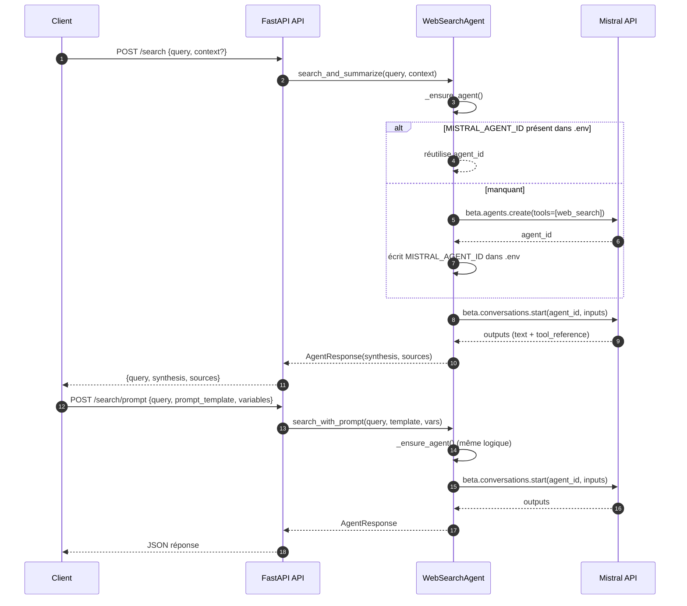
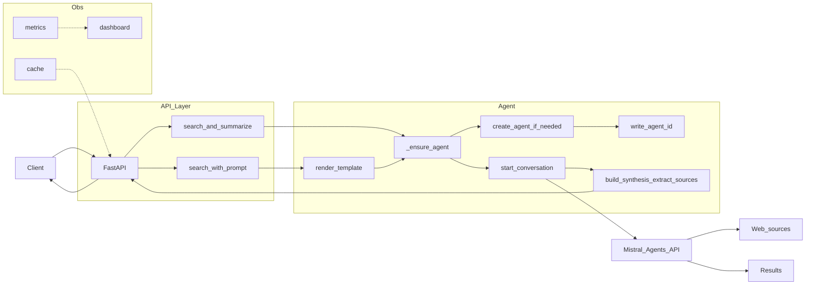
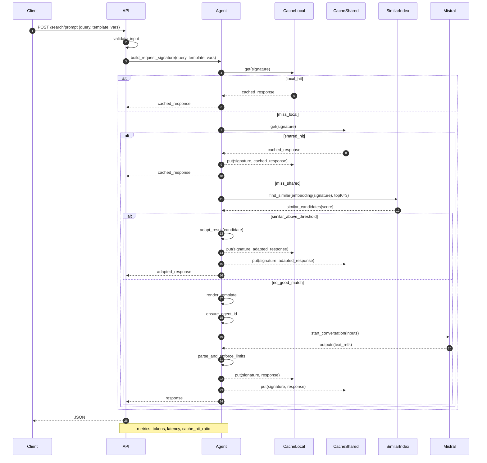

# Mistral WebSearch Agent (minimal)

Agent de recherche web basé sur l'API Mistral (connecteur `web_search`). Projet minimal: uniquement agent, API et configuration.

## 1) Prérequis
- Python 3.10+
- Clé API Mistral: https://console.mistral.ai/

## 2) Installation
```bash
pip install -r requirements.txt
```

## 3) Configuration
1. Copier le fichier d'exemple puis éditer:
```bash
cp .env.example .env
```
2. Mettre votre clé dans `.env`:
```
MISTRAL_API_KEY=VOTRE_CLE
MISTRAL_MODEL=mistral-large-latest
```
> À la première exécution, l'agent créera automatiquement un agent Mistral avec le connecteur web_search et enregistrera `MISTRAL_AGENT_ID` dans `.env`.

## 4) Test rapide (agent direct)
Exécuter une recherche simple sans lancer de serveur:
```bash
python -c "from agent import WebSearchAgent; a=WebSearchAgent(); r=a.search_and_summarize('intelligence artificielle médecine 2024'); print(r.synthesis[:500]); print('\nSources:', len(r.sources)); [print('-', s) for s in r.sources[:5]]"
```

## 5) API HTTP minimale
Lancer l'API FastAPI:
```bash
python api.py
```
Endpoints:
- `GET  /health` — statut de l'API
- `POST /search` — recherche standard avec `query` (et optionnel `context`)
- `POST /search/prompt` — recherche avec template de prompt personnalisé

Exemples:
```bash
# Healthcheck
curl http://localhost:8000/health

# Recherche simple
curl -X POST http://localhost:8000/search \
  -H "Content-Type: application/json" \
  -d '{"query":"intelligence artificielle médecine 2024"}'

# Recherche avec template de prompt
curl -X POST http://localhost:8000/search/prompt \
  -H "Content-Type: application/json" \
  -d '{
    "query": "intelligence artificielle médecine 2024",
    "prompt_template": "Tu es un assistant spécialisé en résumé médical... Limite: {{limite}} mots. Style: {{style}}.",
    "variables": {"limite": 180, "style": "bullet points", "specialite": "Médecine générale", "tonalite": "professionnelle", "medicaments": "anticoagulants", "recommandations": "HAS, ESC"}
  }'
```

## 6) Paramètres supportés
- `.env`
  - `MISTRAL_API_KEY` (obligatoire)
  - `MISTRAL_MODEL` (optionnel, défaut: `mistral-large-latest`)
  - `MISTRAL_AGENT_ID` (optionnel, auto-ajouté après création du premier agent)

## 7) Notes
- Le connecteur `web_search` est utilisé par défaut; le modèle cite des sources (URLs) dans la réponse.
- Le champ `prompt_template` accepte des variables au format `{{nom}}` (remplacement direct côté agent).
- Pour stopper l’API, interrompre le processus (Ctrl+C).


## 8) Diagrammes UML

### 8.1 Diagramme de classes (UML)


### 8.2 Diagramme de séquence (UML)



## 9) Diagramme d’optimisation de l’application (flux & coûts)


### Explication du flux
- Client: l’application qui envoie les requêtes HTTP vers l’API.
- API (FastAPI): reçoit, valide, et route les requêtes vers l’agent.
- API_Layer/Validate: validation et normalisation des entrées.
- Cache: vérifie si une réponse existe déjà (clé dérivée de la requête + template + variables). En cas de hit, retourne aussitôt.
- Agent:
  - render_template: construit le prompt final à partir du template et des variables.
  - ensure_agent_id/create_agent_if_needed: garantit l’existence d’un agent Mistral configuré avec web_search.
  - start_conversation: appelle Mistral (Agents API) pour exécuter la recherche et générer la réponse.
  - parse_and_format: assemble la synthèse et extrait les sources (références/outils).
  - enforce_limits: applique une éventuelle limite (ex. nombre de mots) et formatage.
- Mistral_Agents_API/web_search_tool: effectue la recherche web et retourne des références exploitables.
- Obs (metrics/logs): points d’instrumentation pour suivre volumes, latence, erreurs, tokens, etc.

## 10) Diagramme de séquence optimisé (/search/prompt)


### Pistes d’optimisation complémentaires
- Budgetisation/cutoff: ne pas lancer LLM si coût estimé > budget (p.ex. tokens restants/jour)
- Batching: regrouper des requêtes proches en une seule conversation (mode “digest”)
- Paramètres dynamiques: ajuster temperature/top_p selon criticité clinique
- Filtrage de sources: privilégier HAS, ANSM, PubMed, ESC, ECDC, WHO
- TTL différenciés: augmenter TTL pour requêtes stables (guidelines), réduire pour actualités
- Observabilité: suivre tokens prompts/completions/connectors et p95/p99 latence

